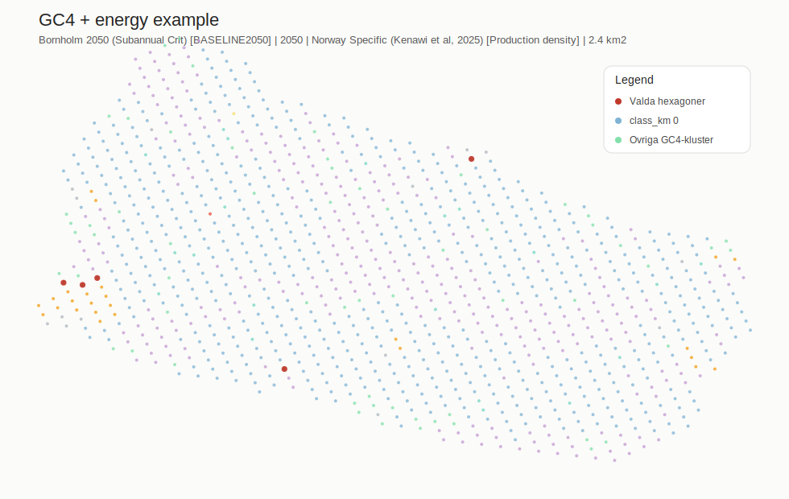
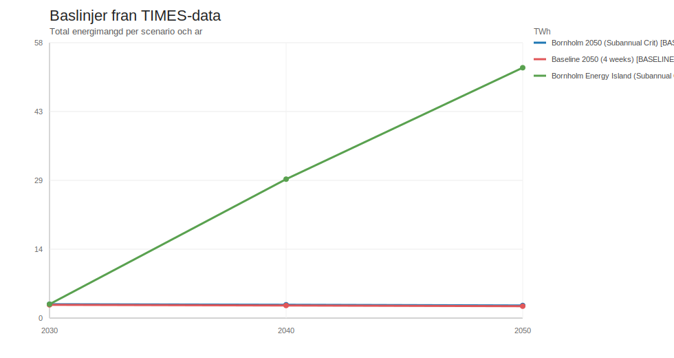
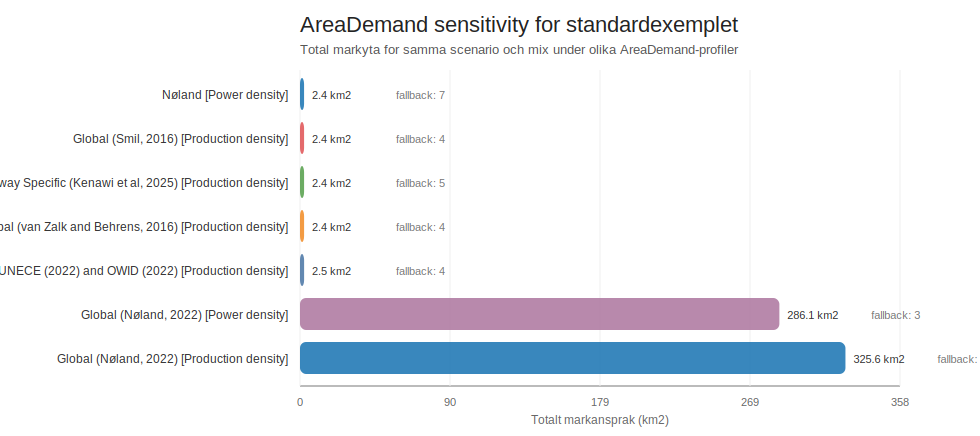

# GC4 Energy App WIP-rapport

Autogenererad: `2026-03-16 16:36:33`

Detta ar en kort arbetsrapport for Streamlit-appen i `apps/gc4/app_gc4_energy.py`. Rapporten ar byggd fran samma lokala data som appen anvander, men figurerna nedan ar statiska rapportbilder och inte webblasar-screenshots.

## Appens roll

Appen ar ett arbetsverktyg for att koppla ihop:

1. TIMES-scenarier for energi per scenario och ar.
2. AreaDemand-antaganden for markintensitet i `km2/TWh`.
3. GC4-geokontext och hexagoner for att visa var olika energiscenarier kan ge landskapspaverkan.

Kort logik:

`TIMES scenario + scenarioar + elmix + AreaDemand-profil -> TWh per energislag -> km2 markbehov -> uppskattat hexbehov och karta`

## Vad som finns i appen

| Del i appen | Roll |
| --- | --- |
| `Valj framtidsbild` | Valjer vilket TIMES-scenario som styr total energimangd och standardmix. |
| `Scenarioar (TIMES)` | Valjer vilket scenarioar som driver TWh, startmix och markansprak. |
| `AreaDemand-kalla` | Valjer vilken litteraturkolumn for markintensitet som ska anvandas. |
| `Utbyggnadszon` | Styr om bara `class_km 0` eller aven extra kluster ska kunna bebyggas. |
| `Elmix sliders (%)` | Lat anvandaren justera mixen. Sliders ar lankade och summerar till 100 %. |
| `Nyckeltal` | Visar scenario, ar, markansprak i km2 och uppskattat antal hexagoner som behovs. |
| `Karta` | Visar GC4-hexagoner, klustertillhorighet och auto-/manuellt valda hexagoner. |
| `TIMESreport output preview` | Visar kalldiagnostik och ett preview-utdrag ur TIMES-data. |
| `AreaDemand sensitivity` | Jamfor total markyta mellan alla tillgangliga AreaDemand-profiler. |
| `AreaDemand transparens` | Visar exakt vilka energislag som kommer fran vald kalla respektive fallback. |
| `Urvalsmetod for hexagoner` | Valjer autoallokering eller manuell utpekning av utbyggnadshexagoner. |
| `Baslinjer (TIMES-data)` | Visar total TWh per scenario och ar som snabb oversikt. |

## Data som rapporten och appen bygger pa

- TIMES-data lases fran lokal DuckDB: `data/processed/speedlocal_times.duckdb`
- AreaDemand-profiler lases fran sidcar-DuckDB: `data/processed/area_demand_profiles.duckdb`
- GC4-poang och klasser lases fran:
  - `jyp_note_book_geocontext/bornholm_points_with_context_gc4.csv`
  - `jyp_note_book_geocontext/bornholm_r8_factor_scores_gc4.csv`
- Tillgangliga AreaDemand-profiler just nu: **7**

## Tillgangliga scenarier i appen

| Scenario-kod | Visningsnamn | Ar i appen |
| --- | --- | --- |
| `BASELINE2050` | Bornholm 2050 (Subannual Crit) [BASELINE2050] | 2030, 2040, 2050 |
| `BASELINE2050-4W` | Baseline 2050 (4 weeks) [BASELINE2050-4W] | 2030, 2040, 2050 |
| `ENERGYISLAND2050` | Bornholm Energy Island (Subannual Crit) [ENERGYISLAND2050] | 2030, 2040, 2050 |

## Standardexempel i denna rapport

- Scenario: **Bornholm 2050 (Subannual Crit) [BASELINE2050]**
- Scenarioar: **2050**
- AreaDemand-kalla: **Norway Specific (Kenawi et al, 2025) [Production density]**
- Utbyggnadszon i exemplet: **class_km [0]**
- Urvalsmetod i exemplet: **Auto**
- Total energimangd: **2.63 TWh**
- Utraknat markansprak: **2.44 km2**
- Beraknat hexbehov: **4**
- Tillgangliga bygghex i zonen: **682**
- Valda hex i autoallokering: **5**

## Karta

Nedan visas en statisk rapportkarta for standardexemplet. Alla GC4-hex visas som punkter, och de autoallokerade hexagonerna ar markerade i rott.



## Diagram

Det forsta diagrammet visar total TWh per scenario och ar. Det andra visar hur kansligt standardexemplet ar for olika AreaDemand-profiler.





## Energi- och markberakning for standardexemplet

| Energislag | Andel % | TWh | km2 | Area-faktorens kalla |
| --- | --- | --- | --- | --- |
| Olja | 41.47 | 1.09 | 0.76 | Intern standard-fallback |
| Ovrigt | 28.42 | 0.75 | 0.75 | Intern standard-fallback |
| El | 17.69 | 0.47 | 0.47 | Intern standard-fallback |
| Bioenergi | 12.31 | 0.32 | 0.45 | Intern standard-fallback |
| Gas | 0.09 | 0.00 | 0.00 | Intern standard-fallback |
| Sol | 0.02 | 0.00 | 0.01 | Norway Specific (Kenawi et al, 2025) [Production density] |
| Vind | 0.01 | 0.00 | 0.00 | Norway Specific (Kenawi et al, 2025) [Production density] |

## Transparens och fallback

- Arvalet hanger nu ihop med **bade** total TWh och standardmix.
- AreaDemand ar transparent: om en vald profil saknar direkta litteraturvarden for vissa energislag visas fallback i appen.
- Standardexemplet anvander fallback for: **Bioenergi, El, Gas, Olja, Ovrigt**
- `AreaDemand sensitivity` ar viktig eftersom olika litteraturkolumner kan ge mycket olika markbehov for samma energiscenario.
- `Manuellt` urval i appen ersatter autoallokeringen och ska tolkas som ett interaktivt planeringslage, inte en optimering.

## Hur denna WIP-rapport uppdateras

Rapporten ar byggd for att kunna uppdateras regelbundet. Nar du vill uppdatera den igen kan vi kora samma generator pa nytt:

```powershell
.\.venv\Scripts\python.exe script\build_gc4_energy_wip_report.py
```

Generatorn skriver over:

- `docs/GC4_ENERGY_APP_WIP_REPORT.md`
- `docs/assets/gc4_energy_app_wip/example_map.svg`
- `docs/assets/gc4_energy_app_wip/baseline_totals.svg`
- `docs/assets/gc4_energy_app_wip/area_sensitivity.svg`

## WIP-status

Detta dokument ar avsiktligt kort och ska fungera som en levande arbetsrapport. Nar du sager till uppdaterar jag samma rapport med nytt innehall, nya figurer och ny status.
